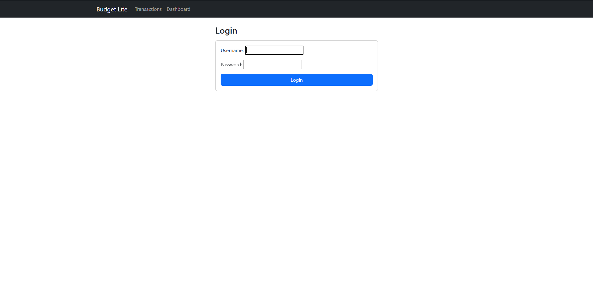
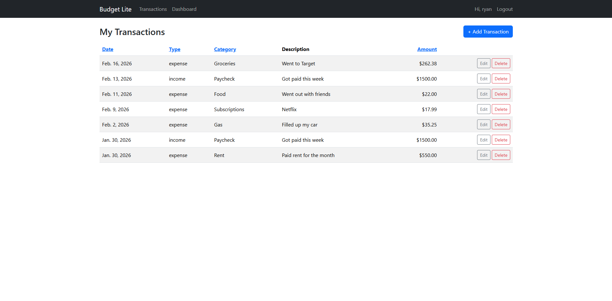
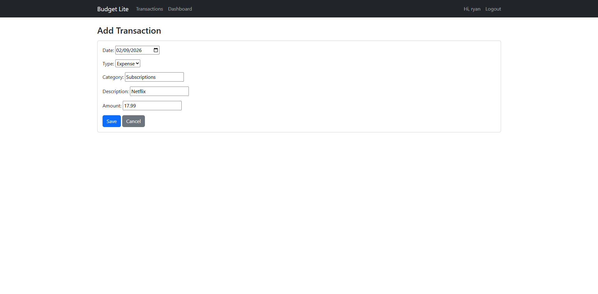
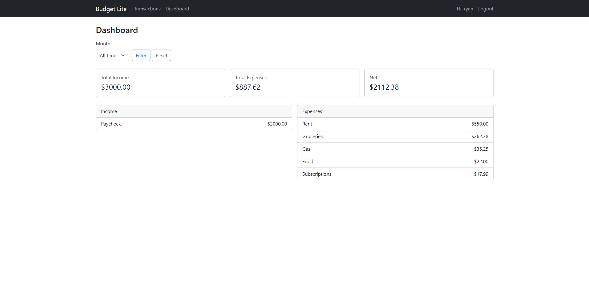

# Budget Lite (Web)

A Django-based web application for tracking personal income and expenses.

Users can register, log in, and manage their own transactions with full CRUD functionality, monthly filtering, category-based reporting, and sortable transaction tables.

This project represents the evolution of the Budget Lite CLI application into a database-backed web application.

---

## Features

- User authentication (login/logout)
- Create, edit, and delete transactions
- Database-backed storage (Django ORM)
- Monthly filtering (YYYY-MM)
- Summary dashboard:
  - Total income
  - Total expenses
  - Net balance
- Category totals (income & expense)
- Sortable transaction table (date, type, category, amount)
- Bootstrap-based responsive UI

---

## Tech Stack

- Python
- Django
- SQLite (development)
- Bootstrap 5

---

## Project Structure

budget-lite-web/
│
├── config/ # Django project configuration
├── transactions/ # Core budgeting app
│ ├── models.py
│ ├── views.py
│ ├── forms.py
│ ├── templates/
│ └── urls.py
├── requirements.txt
└── manage.py

---

## Screenshots

### Login


### Transactions


### Add Transaction


### Dashboard


---

## How to Run Locally

Clone the repository:

```bash
git clone https://github.com/ryancoderjackson/budget-lite-web.git
cd budget-lite-web
# Create and activate a virtual environment:
python -m venv .venv
.venv\Scripts\activate  # Windows
# Install dependencies:
pip install -r requirements.txt
# Apply migrations:
python manage.py migrate
# Create a superuser:
python manage.py createsuperuser
# Run the server:
python manage.py runserver
